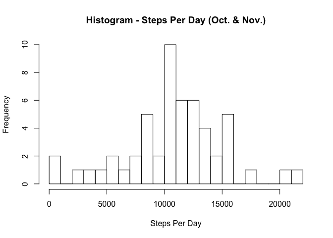
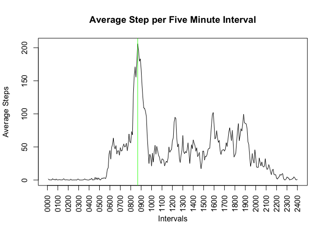
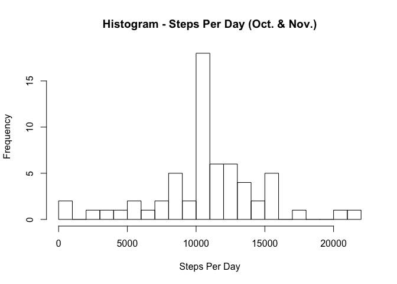
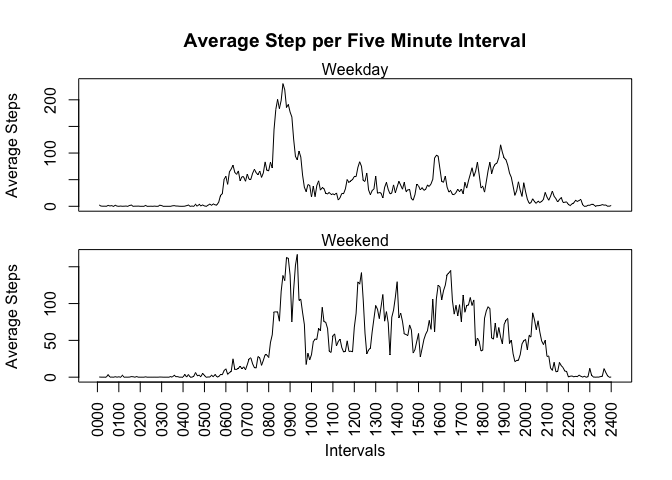

# Reproducible Research: Peer Assessment 1


## Loading and preprocessing the data


```r
# extract zip file and load in resulting CSV
unzip("activity.zip")
activity <- read.csv("activity.csv")
# normalize the interval (pad to 4 characters)
activity$interval <- sprintf("%04d", activity$interval)
# cast $date to Date type
activity$date <- as.Date(activity$date)
```


## What is mean total number of steps taken per day?

```r
# subset only measured observations
activity_measured <- subset(activity, !is.na(activity$steps))
# split up the steps by date and sum each group
activity_sum <- sapply(split(activity_measured$steps, activity_measured$date), sum)
# create histogram
hist(activity_sum, breaks=20, xlab="Steps Per Day",
     main="Histogram - Steps Per Day (Oct. & Nov.)")
```

 

The mean of the total number of steps taken per day is **10766.1887**.  
The media of the total number of steps taken per day is **10765**.


## What is the average daily activity pattern?

```r
# split up the steps by interval and average (mean) each group
activity_ave <- sapply(split(activity_measured$steps, activity_measured$interval), mean)
# create line plot
plot(activity_ave, type="l",
     main="Average Step per Five Minute Interval",
     xlab="Intervals", xaxt="n", ylab="Average Steps")
# add the x-axis
axis(at=seq(0, length(activity_ave), by=12),
     labels=sprintf("%04d", seq(0, 2400, by=100)),
     las=2, side=1)
# draw a line at the highest peak
abline(v=which.max(activity_ave), col="green")
```

 

Question: Which 5-minute interval, on average across all the days in the dataset, contains the maximum number of steps?  
Answer: **0835**.


## Imputing missing values

```r
# count the number of missing measurements
missing_measurements <- sum(is.na(activity$steps))
```
Total number of missing values in the dataset: **2304**

#### Strategy for Imputing Missing Values
In order to fill in the missing data, we'll replace any missing data for a
given interval with the mean for that interval over all observations


```r
# load dplyr
library(dplyr)
# for observations where the steps variable is NA
# replace the NA with the average for that interval
activity_imp <- mutate(activity,
                       steps = ifelse(
                           is.na(steps),
                           activity_ave[interval],
                           steps)
                       )
```

Make a histogram of the total number of steps taken each day and Calculate and report the mean and median total number of steps taken per day. Do these values differ from the estimates from the first part of the assignment? What is the impact of imputing missing data on the estimates of the total daily number of steps?


```r
# split up the steps by date and sum each group, same as above but with the imputed data
activity_imp_sum <- sapply(split(activity_imp$steps, activity_imp$date), sum)
# create histogram
hist(activity_imp_sum, breaks=20, xlab="Steps Per Day",
     main="Histogram - Steps Per Day (Oct. & Nov.)")
```

 

The mean of the total number of steps taken per day is **10766.1887**.  
The median of the total number of steps taken per day is **10766.1887**.

Question: Do these values differ from the estimates from the first part of the assignment? What is the impact of imputing missing data on the estimates of the total daily number of steps?  

Answer: Yes the values do change after imputing the data. The method I chose for imputing was to replace all `NA`s with the mean for the given interval. The causes an increase in Frequency at the mean of the Steps per Day.

## Are there differences in activity patterns between weekdays and weekends?

```r
# Add a factor variable for weekday/weekend
activity_imp$day = factor(
                        weekdays(activity_imp$date) %in% c("Saturday", "Sunday"),
                        labels=c("weekday", "weekend"))

# Split up the data by weekend/weekday
activity_split <- split(activity_imp, activity_imp$day)
# Get the mean for each interval for weekend/weekday
activity_day_mean <- data.frame(sapply(activity_split, function(x) sapply(split(x$steps, x$interval), mean)))

# Set the plot layout
par(mfrow=c(2,1))
# plot out the weekday plot
par(mar=c(1.5,4.1,4.1,2.1))
plot(activity_day_mean$weekday, type="l",
     main="Average Step per Five Minute Interval",
     xaxt="n", ylab="Average Steps")
mtext("Weekday")

# plot out the weekend plot
par(mar=c(5.1,4.1,0.5,2.1))
plot(activity_day_mean$weekend, type="l",
     xlab="Intervals", xaxt="n", ylab="Average Steps")

mtext("Weekend")
axis(at=seq(0, length(activity_ave), by=12),
     labels=sprintf("%04d", seq(0, 2400, by=100)),
     las=2, side=1)
```

 
